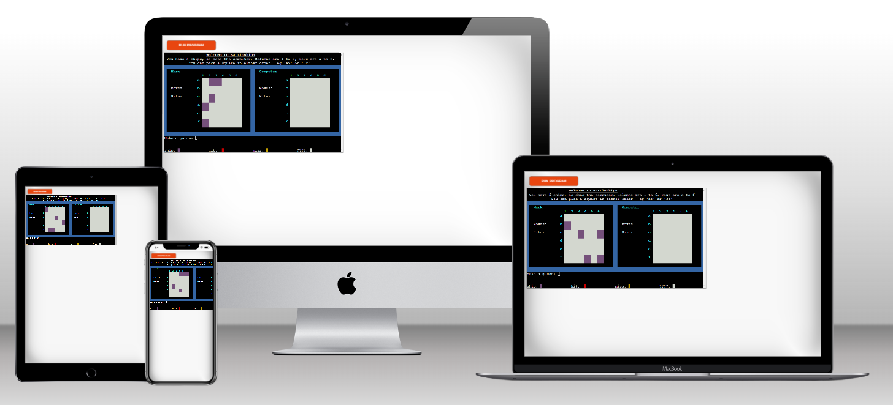
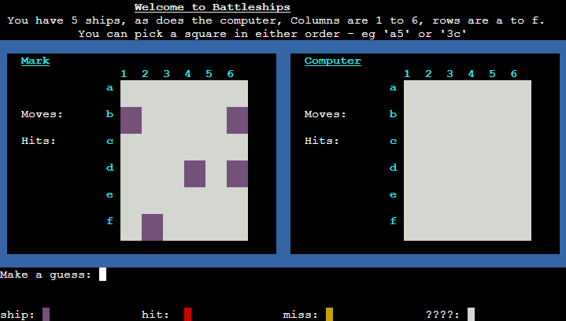
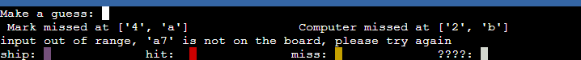
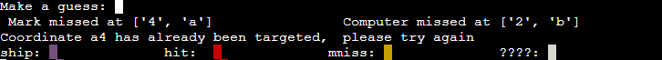
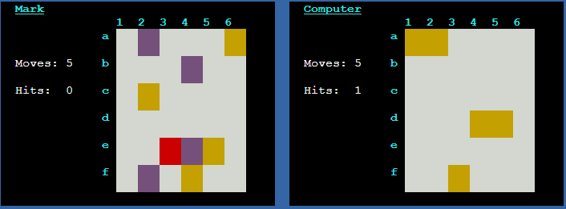
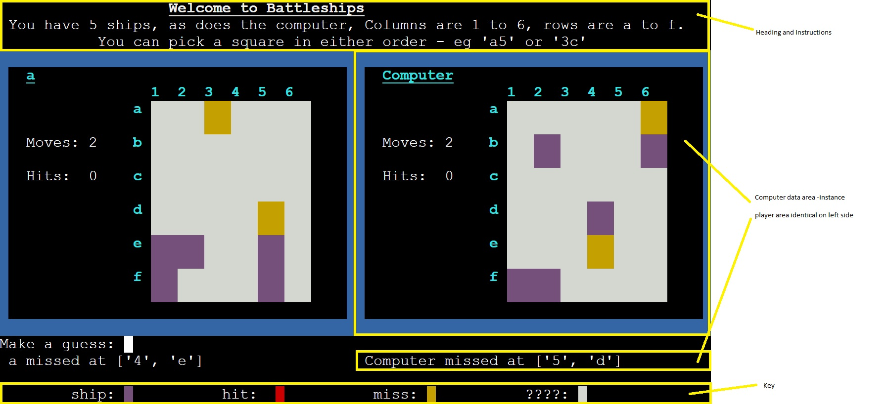
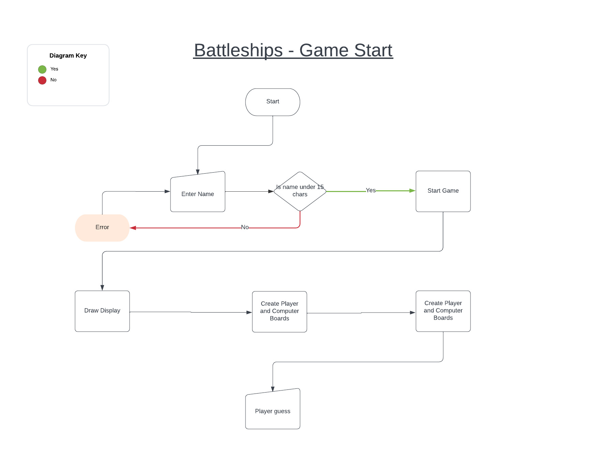
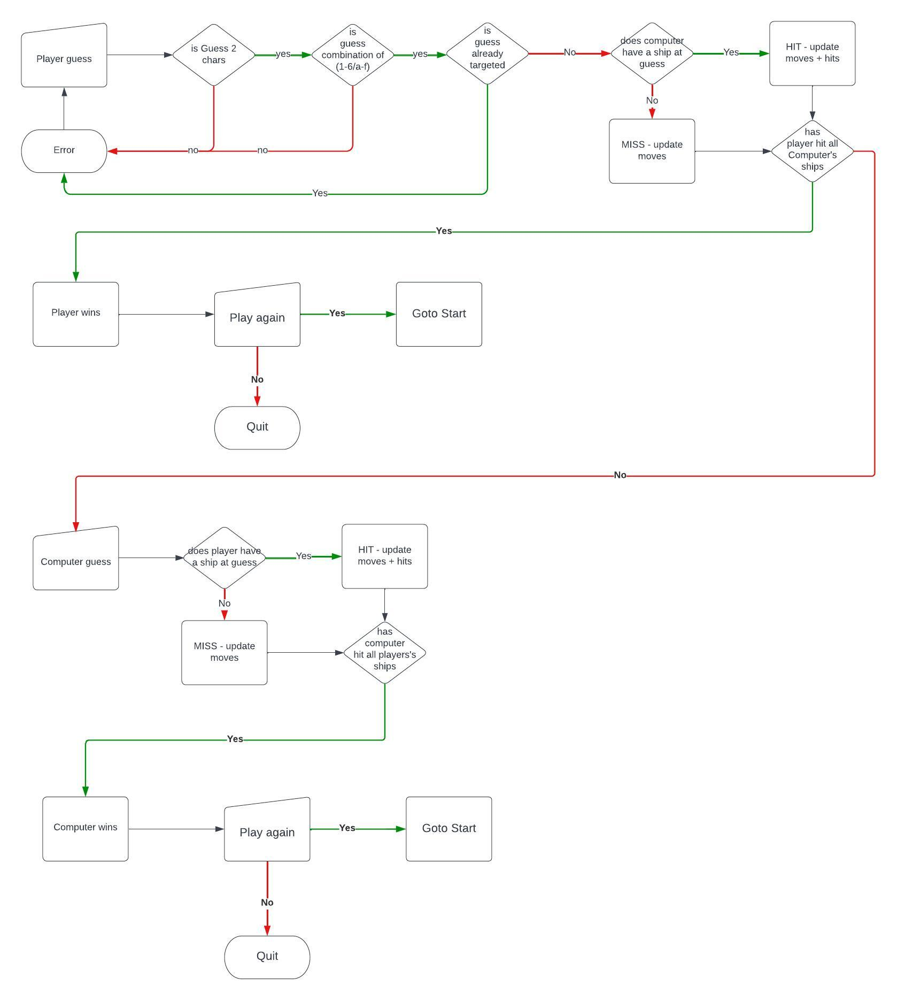

# Battleships

README.md file for my Code Institutute third project.

It is hosted on Heroku here:  
[Battleships](https://battleships279455.herokuapp.com/)  
The GitHub repository:  
[Mark Cooper Python Battleships Github Repository](https://github.com/mark279455/Battleships)

## How To Play

This is a game that I'm sure we all played as children.

Both players start on the same map, with the same number of ships.

Players then make guesses in turns as to where their opponents ships are, and fire shells at them.

The person that 'sinks' all their opponents ships first is the winner.

[Wikipedia Battleships](https://en.wikipedia.org/wiki/Battleship_(game))

---

## Features

As much as possible, with the limitations of the Heroku Python Platform, I have tried to make the game more visual.

a.      The ship placement is randomised.

b.      The player cannot see the computer's ships

c.      The game is played on a 6 by 6 grid, with numbers (1-6) as columns and letters (a-f) as rows.

d.      Input is accepted in the format row/column or column/row - i.e. you can enter 'c4' or '4c'.

e.      The key for the ships is diaplayed during the game.

        - An unknown square is plain white.
        - The players ships are purple.
        - A hit is red.
        - A miss is yellow.

f.      Information about the last moves is shown for both sides.

g.      Error messages are shown if input validation fails. Errors are shown if...

        A coordinate is given that is invalid - i.e. not a letter and a number

        A valid coordinate is given, but not on the map.

        A coordinate has already been targeted.

        
h.      Scores and moves are maintained by the game

## Future Development

Possible developments could be...
-       Different shaped ships - not just one square
-       The player chooses how big the screen is, and how many ships are used. (This is difficult on the Heroku Python platform as there is very limited space)

## Data Model

The game data is stored in a Board Class.
The screen positioning and colors are done by a class ScreenControl.
ScreenControl has static methods for diplaying common information, but the Board class has an instance if ScreenControl in it which controls the seperate data for the player and the Computer.

---

## Testing

### Board Class

The Board class has been tested with a PEP8 linter without issue.
Valid and invalid inputs have been tested as follows.

VALID:
-       1 digit between '1' and '6' with 1 letter between 'a' and 'f'.
        the order does not matter.

INVALID:
-       Anything longer than 2 characters
-       Anything that is not 1 letter and 1 number
-       A valid 1 letter 1 number combination that is outside the map
-       Any valid combination that has been already 'fired upon'.

---

### ScreenControl class

The ScreenControl class has several static methods. These are to display common items on the screen.

There is a static method in ScreenControl called pos(x, y, text).
This is really the workhorse of this class.

Using ANSI coding the display is...
-       80 columns wide - this is the x direction
-       24 rows high - this is the y direction

coordinates start in the top left hand corner at 1,1

pos(x, y, text) takes an x coordinate and a y coordinate, and some text, and prints that text at the x and y positions defined.
The text can also contain codes that define the color of the text.

The ScreenControl class has static methods to print the heading and the instructions, and  the key

The two areas surrounded by the blue frames are controlled by instances od the ScreenControl class which define and monitor events that happen during the game.

Testing for the ScreenControl class involved the following....

-       Heading and instructions printed in the correct place. - lines 1 - 3
-       Key printed in the correct place - line 24
-       The instance areas were printed in the correct place with the blue frames surrounding them. - lines 4 - 20
-       make a guess happened on line 21
-       game status / info messages were printed on line 22
-       error messages were printed on line 23
-       Game end messages were printed on line 22

---

## Logic Flowcharts

