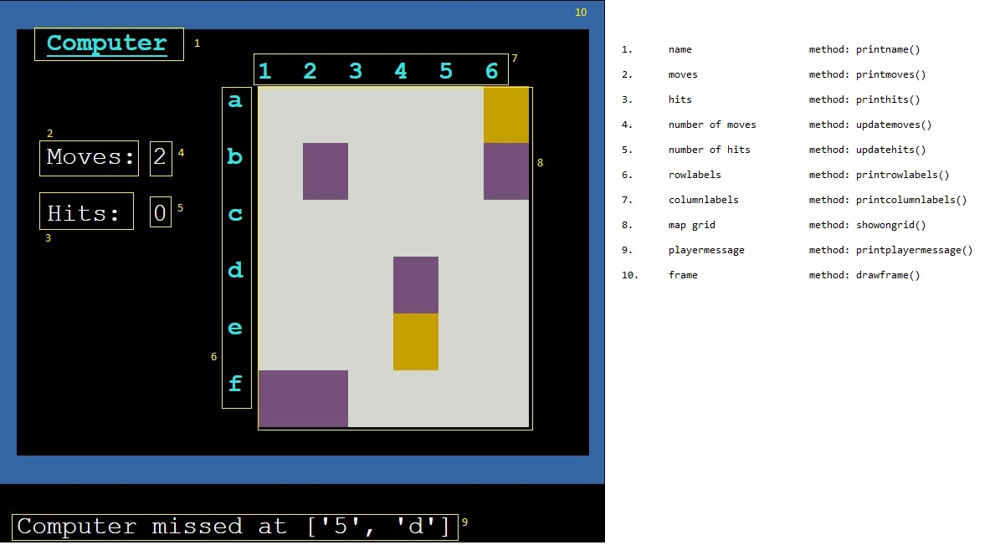
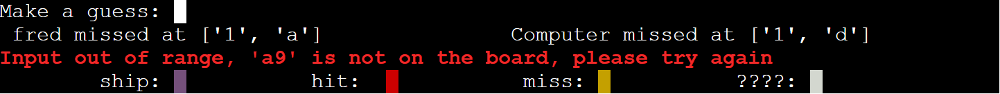
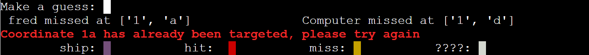

# Battleships

README.md file for my Code Institute third project.

It is hosted on Heroku here:  
[Battleships](https://battleships279455.herokuapp.com/)  
The GitHub repository:  
[Mark Cooper Python Battleships Github Repository](https://github.com/mark279455/Battleships)

## Contents
* [Instructions](#Instructions)
* [Features](#Features)
* [Possible Development](#Possible-Development)
* [Design and Implementation](#Design-and-Implementation)
* [Data Model](#data-model)
* [Technologies Used](#Technologies-Used)
* [Testing](#Testing)
* [Deployment](#Deployment)
* [Credits](#Credits)

---

## Instructions

This is a game that I'm sure we all played as children.

Both players start on the same map, with the same number of ships.

Players then make guesses in turns as to where their opponents ships are, and fire shells at them.

The person that 'sinks' all their opponents ships first is the winner.

[Wikipedia Battleships](https://en.wikipedia.org/wiki/Battleship_(game))

When the boards load you will see your ships on the left, on the right is a map for you to find the conputer's ships.

Both sides have..
        
        2 submarines (2 squares)
        1 cruiser    (3 squares)
        1 battleship (4 squares)

you select your target square by keying the name of the square - one number (1-6) and 1 letter (a-f).

Input is valid no matter which order is used.

---

## Features

As much as possible, with the limitations of the Heroku Python Platform, I have tried to make the game as visual as posisble.

###      The ship placement is randomised for both players.

###     The player cannot see the computer's ships

###     The game is played on a 6 by 6 grid, with numbers (1-6) as columns and letters (a-f) as rows.

###     Input is accepted in the format row/column or column/row - i.e. you can enter 'c4' or '4c'.

###     The key for the ships is displayed during the game.

        - An unknown square is plain white.
        - The players ships are purple.
        - A hit is red.
        - A miss is yellow.

###      Information about the last moves is shown for both sides.

###     Error messages are shown if input validation fails. Errors are shown if...

        - A coordinate is given that is invalid - i.e. not a letter and a number
        - A valid coordinate is given, but not on the map.
        - A coordinate has already been targeted.
- see * [Testing](#Testing)
        

###     Scores and moves are maintained by the game

---

## Possible Development

Possible developments could be...
-       The player chooses how big the screen is, and how many ships are used. (This is difficult 
                on the Heroku Python platform as there is very limited space)

---
## Design and Implementation

## Data Model

The game data is stored in a Board Class.
The screen positioning and colors are done by a class ScreenControl.
ScreenControl has static methods for displaying common information, but the Board class has an instance of ScreenControl in which it controls the separate data for the player and the Computer.

It is recommended that logging is implemented for development in this project, as printing data to the display, corrupts the display and make things awkward.

---

### Board Class

The Board class has been tested with a PEP8 linter without issue.
Valid and invalid inputs have been tested as follows.

VALID:
-       1 digit between '1' and '6' with 1 letter between 'a' and 'f'.
        the order does not matter.

INVALID:

        - Anything longer than 2 characters
        - Anything that is not 1 letter and 1 number
        - A valid 1 letter 1 number combination that is outside the map
        - Any valid combination that has been already 'fired upon'.

---

### ScreenControl class

The ScreenControl class has several static methods. These are to display common items on the screen.

There is a static method in ScreenControl called pos(x, y, text).
This is really the workhorse of this class.

Using ANSI coding the display is...

        - 80 columns wide - this is the x direction
        - 24 rows high - this is the y direction

coordinates start in the top left hand corner at 1,1

pos(x, y, text) takes an x coordinate and a y coordinate, and some text, and prints that text at the x and y positions defined.

The text can also contain codes that define the color of the text.

The ScreenControl class has static methods to print the heading and the instructions, and  the key

The two areas surrounded by the blue frames are controlled by instances of the ScreenControl class which define and monitor events that happen during the game.

## static

Testing for the static ScreenControl class involved the following....

        - Heading and instructions printed in the correct place. - lines 1 / 3
        - Key printed in the correct place - line 24
        - make a guess prints on line 21
        - game status / info messages were printed on line 22
        - error messages were printed on line 23
        - Game end messages were printed on line 22

## instance

There are 10 parts to the instance areas of ScreenControl

All fields are offset from position 1,1 by the instance variables
self.start_x and self.start_y.
This creates an 'origin' for each instance method.

- name

        - method:       printname()
        - The printname() method prints the player's name or the Computer's name.
        - It is printed at coordinates defined by self.start_x and
                self_start_y and name_start_x

        - The instance areas were printed in the correct place with the blue frames 
                surrounding them. - lines 4 / 20

- moves

        - method:       printmoves()
        - The word moves is printed by the printmoves() method
        - The position is in the instance area at 
                self.start_x + moves_start_x, self.start_y + moves_start_y

- hits

        - method:       printhits()
        - The word moves is printed by the printhits() method
        - The position is in the instance area at 
                self.start_x + hits_start_x, self.start_y + hits_start_y

- number of moves

        - method:       updatemoves()
        - The number of moves taken during the game is updated here

- number of hits

        - method:       updatehits()
        - The number of hits made on opposing ships during the game is updated here

- rowlabels

        - method:       printrowlabels()
        - The column labels are generated as a string from the size of the
                board.
        - GRID_GAP_X is the gap between coordinates in the grid map.
        - The position is calculated from the rows and colums in 
                the Board class, and printed in the instance area at 
                self.start_x + row_label_x, for the horizontal position,
                and a calculation involving the GRID_GAP_X for the self.start_y + column_label_y

- columnlabels

        - method:       printcolumnlabels()
        - The column labels are generated as a string from the size of the
                board.
        - The position is in the instance area at 
                self.start_x + column_label_x, self.start_y + column_label_y

- map grid

        - method:       showongrid()
        - The map grid is printed here at the start of the game, and squares are updated during play using the showongrid() method

- playermessage

        - method:       printplayermessage()
        - the players hit/miss messages are printed here using the printplayermessage() method

- frame

        - method:       drawframe()
        - The drawframe() method prints the blue square around the 
                instance area.
        - It is printed at coordinates defined by ScreenControl.START_X, 
                self.start_x frame_top_x and frame_bottom_y.
        - A horizontal line is drawn across half the screen width at
                frame_top_y, and frame_bottom_y.
        - A vertical line is drawn at the first and last column of 
                the instance area.
                        

---

## Logic Flowcharts

Flowcharts provided for game logic.

---
## Testing

Both of the code files were successfully run though the [Code Institute PEP8 Linter](https://pep8ci.herokuapp.com/)  

Testing was performed on all parts of the screen positioning code to
        check that text appeared in the correct part of the display.

Testing was performed on all incorrect player input...

###      Error messages are shown if input validation fails. Errors are shown if...

        A coordinate is given that is invalid - i.e. not a letter and a number

        A valid coordinate is given, but not on the map.

        A coordinate has already been targeted.

        

---

## Technologies Used

        This project uses Python.
        
        Plugins:
                Colorama - gives access to ANSI screen control codes.

        Development was done using Gitpod.
        
        Heroku Cloud applictaion platform
--- 

## Deployment

The project was deployed using the Heroku Cloud applictaion platform.

It is assumed here that GitHub and GitPod accounts are already set up.

Preliminary steps...

a.	from the console window in GitPod enter the following command..

		pip freeze > requirements.txt
	
	This will push the requirements of the project into the requirements.txt file,
	and allow Heroku the configuration information that it needs to build the project.
	
b.	Make sure changes are committed and pushed to GitHub before continuing.

To deploy to Heroku, follow these steps...

a.	Go to [Heroku](https://www.heroku.com/) and create a free account.

b.	The site will send an email for verification. Perform the required email confirmation.

c.	Once logged in....

        	Click new / Create new app
	
d.	Give the app a unique name, pick your region between United States and Europe, and click "Create app".

e.	Click on the Settings tab, and go to the Buildpacks section.

f.	Click "Add buildpack", select the "Python" option, and click save.

g.	Click "Add buildpack" select the "nodejs" option, and click save.

		Make sure that "python" is the first option and "nodejs" the second.
			- they can be dragged here to change the order.
			
h.	Settings are complete - click the "Deploy" tab.

i.	Click GitHub for Deployment method

		search for the project name in the search box, and click connect.
		
j.	From here you can select Automatic or Manual deploy.

		Automatic deploy will re-deploy the application every time the project is "git pushed".
		
k.	If you select "Manual deploy", after the project has been built, click "view" to 
                see the deployed page.

---

## Credits

The Heroku Python template was provided by Code Institute.
Thanks to Gareth McGirr - my course mentor.
Code Institute tutors helped vastly when my GitHub repository started playing up.
The Code Institute Slack Community

