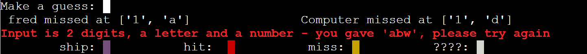

# Battleships

README.md file for my Code Institutute third project.

It is hosted on Heroku here:  
[Battleships](https://battleships279455.herokuapp.com/)  
The GitHub repository:  
[Mark Cooper Python Battleships Github Repository](https://github.com/mark279455/Battleships)

## How To Play

This is a game that I'm sure we all played as children.

Both players start on the same map, with the same number of ships.

Players then make guesses in turns as to where their opponents ships are, and fire shells at them.

The person that 'sinks' all their opponents ships first is the winner.

[Wikipedia Battleships](https://en.wikipedia.org/wiki/Battleship_(game))

## Features

As much as possible, with the limitations of the Heroku Python Platform, I have tried to make the game more visual.

a.  The ship placement is randomised.

b.  The player cannot see the computer's ships

c.  The game is played on a 6 by 6 grid, with numbers (1-6) as columns and letters (a-f) as rows.

d.  Input is accepted in the format row/column or column/row - i.e. you can enter 'c4' or '4c'.

e.  The key for the ships is diaplayed during the game.

        An unknown square is plain white.
        The players ships are purple.
        A hit is red.
        A miss is yellow.

f.  Information about the last moves is shown for both sides.

g.  Error messages are shown if input validation fails. Errors are shown if...

        A coordinate is given that is invalid - i.e. not a letter and a number
        
        A valid coordinate is given, but not on the map.
        
        A coordinate has already been targeted.
        
        

## Data Model

The game data is stored in a Board Class.
The screen positioning and colors are done by a class ScreenControl.
ScreenControl has static methods for diplaying common information, but the Board class has an instance if ScreenControl in it which controls the seperate data for the player and the Computer.

